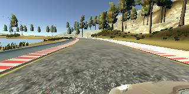
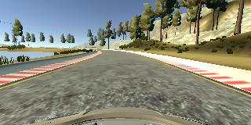
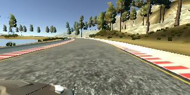
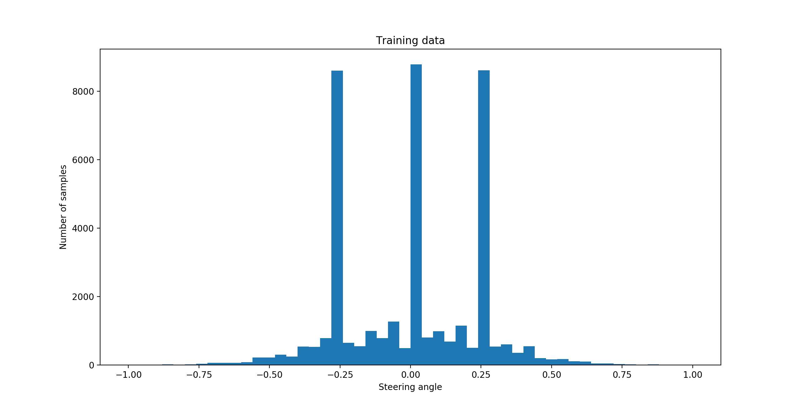
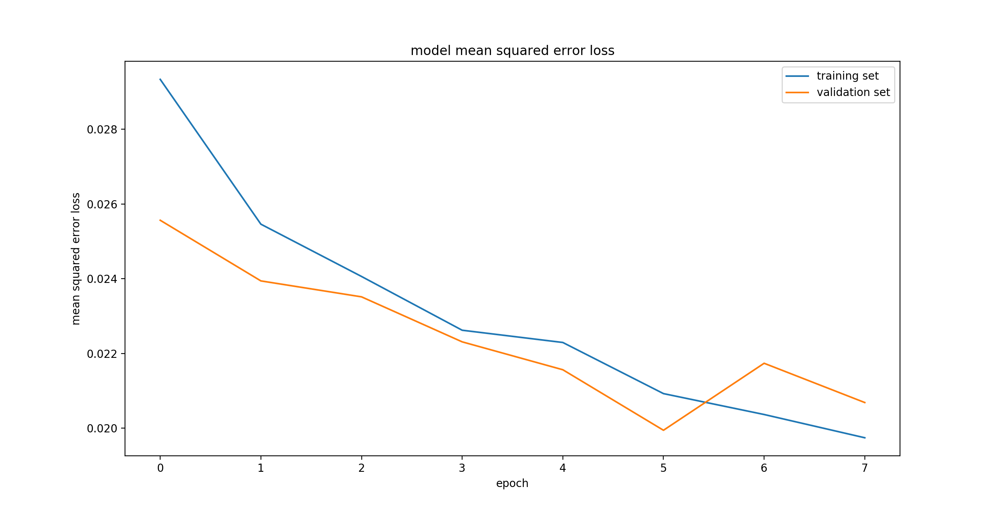

# **Behavioral Cloning**

**Behavioral Cloning Project**

The goals / steps of this project are the following:
* Use the simulator to collect data of good driving behavior
* Build, a convolution neural network in Keras that predicts steering angles from images
* Train and validate the model with a training and validation set
* Test that the model successfully drives around track one without leaving the road
* Summarize the results with a written report

[//]: # (Image References)

[image1]: ./examples/placeholder.png "Model Visualization"
[image2]:./images/nvidia_cnn-architecture-624x890.png "nVidia"


#### 1. Overview

My project includes the following files:
* **model.py** containing the code to collect the training data and train the model.
* **cnn.py** containing the code to create the CNN model.
* **drive.py** for driving the car in autonomous mode.
* **model.h5** containing a trained CNN model to for driving autonomously.
* **driveWithTrainedModel.sh** script to drive the car in autonomous mode using the trained CNN model.
* **plotTrainingHistory.sh** script to plot the training history data.
* **track1.mp4** a video recorded while driving one lap with the trained model on track one.

The **model.py** file contains the code for preparing the training data, training and saving the convolution neural network. The file shows the pipeline I used for training and validating the model.

The **cnn.py** file contains the code to create the CNN model using Keras.

### Model Architecture

#### 1. Solution Design Approach
Like suggested from the Behavioral module I decided to build my model based on the CNN architecture invented by the [NVIDIA Autonomous Car Group](https://devblogs.nvidia.com/parallelforall/deep-learning-self-driving-cars/). The architecture consists of 9 layers, including a normalization layer, 5 convolutional layers, and 3 fully connected layers.

Here's a visualization of the NVIDIA CNN architecture:


#### 2. Final Model Architecture
I implemented the CNN model by using the [Keras library](https://keras.io/). The complete code for creating the model can be found in [cnn.py line 5-34](cnn.py#L5-L34).

A few modifications to the NVIDIA CNN architecture described above were taken:

To let the model "concentrate" on relevant information in the image only, I added a cropping layer between the lambda normalization layer and the first convolutional layer ([cnn.py line 11](cnn.py#L11)). This layer reduces the image size from 160x320 to 90x320 pixels.


As the model shall provide a single output value only (steering angle) I also added another fully connected layer with a single neuron to the end ([cnn.py line 32](cnn.py#L32)).

Here's a summary of the final model architecture:

```
____________________________________________________________________________________________________
Layer (type)                     Output Shape          Param #     Connected to
====================================================================================================
lambda_1 (Lambda)                (None, 160, 320, 3)   0           lambda_input_1[0][0]
____________________________________________________________________________________________________
cropping2d_1 (Cropping2D)        (None, 90, 320, 3)    0           lambda_1[0][0]
____________________________________________________________________________________________________
convolution2d_1 (Convolution2D)  (None, 43, 158, 24)   1824        cropping2d_1[0][0]
____________________________________________________________________________________________________
convolution2d_2 (Convolution2D)  (None, 20, 77, 36)    21636       convolution2d_1[0][0]
____________________________________________________________________________________________________
convolution2d_3 (Convolution2D)  (None, 8, 37, 48)     43248       convolution2d_2[0][0]
____________________________________________________________________________________________________
convolution2d_4 (Convolution2D)  (None, 6, 35, 64)     27712       convolution2d_3[0][0]
____________________________________________________________________________________________________
convolution2d_5 (Convolution2D)  (None, 4, 33, 64)     36928       convolution2d_4[0][0]
____________________________________________________________________________________________________
flatten_1 (Flatten)              (None, 8448)          0           convolution2d_5[0][0]
____________________________________________________________________________________________________
dense_1 (Dense)                  (None, 100)           844900      flatten_1[0][0]
____________________________________________________________________________________________________
dense_2 (Dense)                  (None, 50)            5050        dense_1[0][0]
____________________________________________________________________________________________________
dense_3 (Dense)                  (None, 10)            510         dense_2[0][0]
____________________________________________________________________________________________________
dense_4 (Dense)                  (None, 1)             11          dense_3[0][0]
====================================================================================================
Total params: 981,819
Trainable params: 981,819
Non-trainable params: 0
```

### Data Collection and Training Strategy

#### 1. Creation of the Training data
Training data was chosen to keep the vehicle driving on the road. I used a combination of the data provided by Udacity and data derived from the first track driving by myself.

To capture good driving behavior, I first recorded a few laps using center lane driving. To generalize the training I also recorded some data while driving in the opposite direction. The following three exemplary data samples are images taken from the left, center and right camera perspective at the same point in time:





Because the road on track one is straight most of the time a additionally recorded data driving in curves only.

```
Data source                             Number of samples          
============================================================
Center lane driving                          14031          
____________________________________________________________
Curve driving                                 2805          
____________________________________________________________
Udacity data                                 24108          
============================================================
SUM                                          40944       
```

The following histogram plot shows a summary of the full data used for training and validation.



The histogram clearly shows that the data has is strongly biased towards small steering angles (peak around 0.00). This was somehow expected because track one has many straight road sections. The two data peaks at -0.25 and 0.25 come from the fact that the steering angle for the left and right camera image was calculated by adding a constant offset of +/- 0.25 to measured angle (see [model.py line 14](model.py#L14-L15)).

### 2. Training process
Before training the model the whole set of sample data (40944) was randomly split into a training set (80% of all samples) and validation set (20% of all samples). The splitting is done in [model.py line 82](model.py#L82).

To keep the overall memory usage low I used as Keras fit_generator and implemented a python generator that provides training data "on the fly" ([model.py line 34-69](model.py#L34-L69).).

##### Attempts to reduce overfitting
I didn't use any regularization techniques (e.g. Dropout) in the model architecture. To prevent overfitting I trained the model with a relatively low number of epochs (8).

Besides that, the training data was augmented by randomly flipping images and steering angles during the training process ([model.py line 60](model.py#L60)).

To weaken the bias towards low steering angles in the training set I decided to raomly skip samples with low steering angle ([model.py line 51](model.py#L51)).

##### Model parameter tuning
The model used an adam optimizer, so the learning rate was not tuned manually ([model.py line 75](model.py#L75)).

I chose a batch size of 34 and epoch was 8 ([model.py line 84-86](model.py#L84-L86)).

##### Training results
The the training train_history is visualized by the following plot. It shows that the error loss for the training data was constantly decreasing, while the validation error alternated after the sixth training epoch.




###### Model testing

The trained model was tested on track one of the simulator. The file **track1.p4** shows a automated test drive with the the final model.
